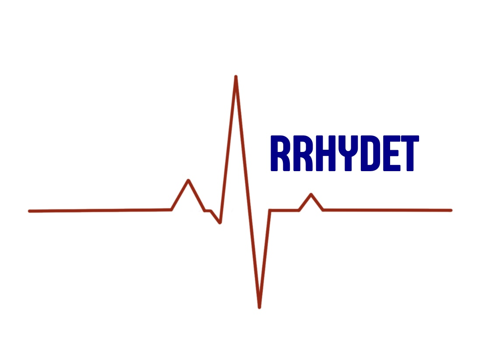

# arrhydet

Arrhythmia detector based on machine learning algorithms

## About arrhydet

arrhydet - a complex tool that includes algorithms for digital processing of ECG signals, statistical processing of a dataset consisting of the main ECG indicators, training a deep neural network with the task of multiclass classification of cardiac arrhythmias with support for using the trained model on embedded systems platforms.